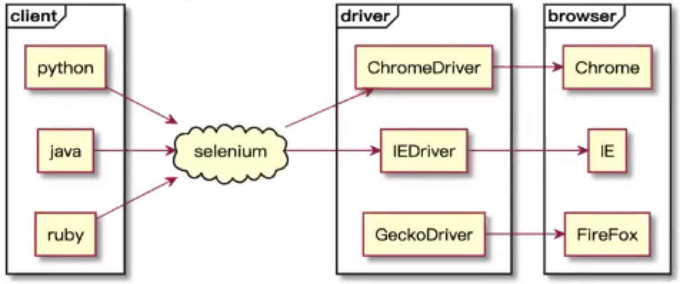
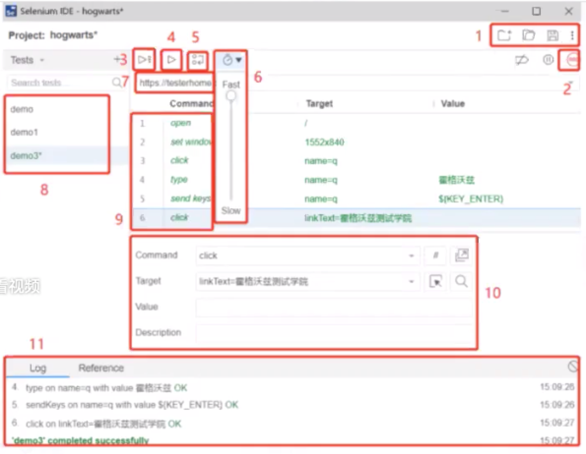

# Selenium3.0 For Java

什么叫框架？
- 框架是整个或部分系统的**可重用**设计，表现为一组抽象构建及构建实例间交互的方法。
- 框架是被应用开发者定制的**应用骨架**。

什么叫自动化测试框架？
- 定义：由一个或多个自动化测试基础模块、自动化测试管理模块、自动化测试统计模块等组成的**工具集合**。

自动化测试框架设计原则
- 通用性
- 易维护性
- 定时处理
- 持续集成
- 调试
- 测试结果

框架设计思想和设计模式
- 外部框架：主要是指以WebDriver为核心，辅以外部第三方框架和工具，用以实现持续集成、自动部署、脚本执行、远程调用、报告优化、邮件发送等功能性框架
    - Maven：自动编译、执行TestNG、集成邮件发送等
    - TESTNG：调用WebDriver、执行自动化测试用例
    - SELENIUM：自动化测试脚本
    - REPORTNG：报告优化模板
    - MAIL：自定义html邮件通知
    - 除了上面的外部框架外，也会使用其他组件来进行摘要日志的记录以及大数据执行的数据分析过程
    - 使用Log4j分级日志来进行日志的整理
    - 使用EXTENTX来进行数据收集及分析
- 内部框架：又称为分层框架，目的在于更好的优化和管理测试用例、更便捷的进行数据、元素、脚本的维护和更快捷的创建新脚本。

## Selenium3.0的变动
- 只支持Java8以上
- Selenium RC下线
- 对于WebDriver方面变动较大
    - FireFox浏览器需要继承GeckoDriver
    - Safari浏览器由苹果公司提供了原生的SafariDriver
    - Edge浏览器由MS提供了EdgeDriver
    - IE8及以下版本不再兼容

## Selenium的介绍
- 简介
    - Selenium支持web浏览器的自动化。它主要由三个工具构成：WebDriver、IDE、Gird
    - [官方网站](https://www.selenium.dev/)
    
## Selenium架构图


## Driver的配置
- Driver的介绍
    - [Driver的介绍](https://www.selenium.dev/documentation/en/webdriver/driver_requirements/)
- Driver的下载
    - [淘宝镜像](https://npm.taobao.org/mirrors/chromedriver)
    - [官方网站](https://chromedriver.storage.googleapis.com/index.html)
- Driver的安装
    - 找到与自己本机浏览器适配的driver版本http://chromedriver.chromium.org/downloads/version-selection
    - 导入环境变量中
    ```
    # chromedrvier
    export PATH="$PATH:/Users/apple/Documents/webdriver" # chromedriver下载放置的目录
    ```

## Selenium IDE
### 下载及安装
- [官网](https://www.selenium.dev)
- [Chrome插件](https://chrome.google.com/webstore/detail/selenium-ide/mooikfkahbdckldjjndioackbalphokd)
- [Firefox插件](https://addons.mozilla.org/en-US/firefox/addon/selenium-ide/)
- [github release](https://github.com/SeleniumHQ/selenium-ide/releases)
- [其他版本](https://addons.mozilla.org/en-GB/firefox/addon/selenium-ide/versions/)
- 注意：Chrome插件在国内无法下载，Firefox可以直接下载

### 启动IDE
- 安装完成后，通过在浏览器的菜单栏中点击它的图标来启动它
- 如果没看到图标，首先确保是否安装了Selenium IDE扩展插件，其次可以在下面的地址访问所有插件
    - Chrome:chrome://extensions
    - Firefox:about:addons

### 录制第一个用例
- 创建新项目后，系统将提示为其命名
- 然后要求提供URL：要录制测试脚本的网站URL。设置一次就可以在整个项目的所有测试中使用
- 在页面的操作都将记录在IDE中。操作完成后，请切换到IDE窗口，并单击[停止]录制图标
- 停止后，为刚录制的Test取名
    
### IDE的使用


1. 新建、保存、打开
2. 开始和停止录制
3. 运行8中的所有的实例
4. 运行单个实例
5. 调试模式
6. 调整案例的运行速度
7. 要录制的网址
8. 实例列表
9. 动作、目标、值
10. 对单条命令的解释
11. 运行日志

### 管理用例
- Suites
    - 当Test越来越多时，可以将多个Test归类到Suites中，Suites就像小柜子。
    - 创建项目时，IDE会创建一个默认Suite，并将第一个Test添加到其中，你可以点击Test，在下拉菜单中选中Test Suites管理界面
    - 首先进入Suites管理界面，点击[+]，提供名称，然后单击[add]
    - 将鼠标悬停到`suite1`上，点击[三个点]弹出Suites管理菜单
    - 可以对`suite1`进行管理，包括添加test，重命名，删除，设置，导出

### 扩展
- [代码导出](https://selenium.dev/selenium-ide/docs/en/introduction/code-export)
- [常见问题](https://selenium.dev/selenium-ide/docs/en/introduction/faq)

## Web控件的交互进阶
常用的操作事件（右键点击、页面滑动、表单操作等）

### Actions
- 官方文档：https://www.selenium.dev/selenium/docs/api/java/index.html
- Actions:执行PC端的鼠标点击，双击，右键，拖拽等事件
- TouchActions：模拟PC和移动端的点击，滑动，拖拽，多点触控等多种手势操作

#### Actions方法列表
- Actions类是selenium对鼠标、键盘操作的
- 常用的操作包括：
    - click——单击鼠标左键
    - click_and_hold——点击鼠标左键，不松开
    - context_click——点击鼠标右键
    - double_click——双击鼠标左键
    - drag_and_drop——拖拽到某个元素到目标位置后松开
    - drag_and_drop_by_offset——拖拽到某个坐标然后松开
    - move_by_offset——鼠标从当前位置移动到某个坐标
    - move_to_element——鼠标移动到某个元素
    - move_to_element_with_offset——移动到距某个元素（左上角坐标）多少距离的位置
    - perform()——执行链中的所有动作
    - releas——在某个元素位置松开左键
    - send_keys——发送某个键到当前焦点的元素
    - key_down——按下某个键盘上的键
    - key_up——松开某个键

#### 动作链接Actions
- 执行原理：
    - 调用Action是的方法，不会立即执行，而是将所有的操作，按顺序存放在一个队列里，当调用perform()方法时，队列中事件会依次执行
- 基本用法
    - 生成一个动作Actions actions = new Actions(driver)
    - 动作添加方法1 actions.方法1
    - 动作添加方法2 actions.方法2
    - 调用perform()方法执行actions.perform()

#### Actions具体写法
- 链式写法
```
Actions actions = new Actions(driver).moveToElement(ele).click().perform(ele);
```
- 分布写法
```
Actions actions = new Actions(driver);
actions.move_to_element(ele);
actions.click(element);
actions.perform();
```
#### Actions模拟按键方法
- 模拟按键有多种方法，能用win32api来实现，能用SendKeys来实现，也可以用selenium的WebElement对象的send_keys()方法来实现，这里Actions类也提供了几个模拟按键的方法
- 用法
```
Actions actions = Actions(driver);
actions.send_keys(Keys.BACK_SPACE);
或者
actions.key_down(Keys.CONTROL).send_keys('a').key_up(Keys.CONTROL);
actions.perform();
```

### 多窗口处理
- 点某些连接，会重新打开一个窗口，对于这种情况，想在新页面上操作，就得先切换窗口了
- 获取窗口的唯一标识用句柄表示，所以只需要切换句柄，就可以在多个页面灵活操作了

#### 多窗口处理流程
1. 先获取到当前的窗口句柄（driver.getWindowHandle()）
2. 再获取到所有的窗口句柄（driver.getWindowHandles）
3. 判断是否是想要操作的窗口，如果是，就可以对窗口进行操作，如果不是跳转到另一个窗口，对另一个窗口进行操作（driver.switchTo().window(name)）